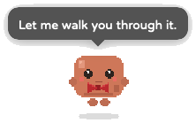
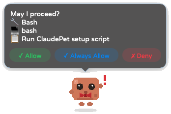
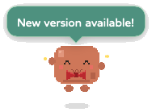

# ClaudePet

Your desktop buddy for Claude Code. Intercepts permissions, pops notifications, mumbles to itself.

<p align="center">
  
</p>

<p align="center">
  
  
  
</p>

A pixel-art desktop pet that lives next to your terminal.
It replaces Claude Code's permission prompts with clickable speech bubbles,
notifies you when work is done, and occasionally talks to itself when bored.
Create your own character with custom dialogue, sprites, and sounds.

## Features 

- Pixel-art character with idle, bow, alert, and happy animations (4 frames each)
- Speech bubbles for "work complete", "needs your input", and "plan ready" notifications
- Authorization flow with three options: approve once, always approve this tool, or deny
- Idle chatter: the character mumbles to itself throughout the day, driven by a cron-scheduled subagent
- Persona system: swap characters with different dialogue, sprites, and sound effects
- Status bar menu for toggling visibility, switching personas, and controlling idle chatter
- Sound effects on notifications and authorization requests (per-persona, with fallback)
- Auto-launch via a shell wrapper that starts ClaudePet before every `claude` invocation

## How it works 

ClaudePet runs an HTTP server on `127.0.0.1:23987`. Two Claude Code hooks feed it events: a Stop hook sends notifications when work finishes, and a PreToolUse hook intercepts tool calls that need authorization. The authorization bubble holds the HTTP connection until you click approve or deny, so Claude Code pauses in the meantime.

"Always approve" remembers the tool name for the rest of the session. The memory clears when ClaudePet exits.

For the full HTTP API, animation state machine, and hook integration details, see [CLAUDE.md](CLAUDE.md).

## Quick start 

Requirements: macOS 13+, Swift 5.9+ (Xcode Command Line Tools), `jq`

```bash
git clone https://github.com/qaz61328/ClaudePet.git
cd ClaudePet
bash scripts/setup.sh
```

The setup script builds the binary, configures Claude Code hooks, sets up idle chatter scheduling, and adds a shell wrapper so ClaudePet launches with every `claude` invocation.

For step-by-step instructions or manual configuration, see [SETUP.md](docs/SETUP.md) | [繁體中文](docs/SETUP_zh-TW.md).

## Update 

Click **Check for Updates** in the status bar menu. ClaudePet checks the latest GitHub Release and walks you through the upgrade automatically.

To update manually:

```bash
git pull origin main
bash scripts/upgrade.sh
```

The upgrade script rebuilds the binary, updates Claude Code hooks and configs, and restarts ClaudePet.

## Uninstall 

```bash
bash scripts/uninstall.sh
```

This removes all ClaudePet environment configs: Claude Code hooks, idle chatter scheduling, the shell wrapper, and temp files. It does not delete the repo itself.

## Personas

Every character is fully customizable — dialogue, pixel sprites, and sound effects. Build your own or use the built-in default.

<p align="center">
  
  
  
  
  
</p>

The fastest way: run `/create-persona` inside Claude Code. It walks you through character design and generates everything.

You can also build a persona by hand. Drop a `persona.json` plus optional sprites and sounds into `Personas/<your-id>/`. See [CLAUDE.md](CLAUDE.md) for the full persona architecture.

Switch between installed personas from the status bar menu.

## FAQ 

See [FAQ.md](docs/FAQ.md) | [繁體中文](docs/FAQ_zh-TW.md)

## Contributing

This project is built by me and Claude Code together. If you run into any issues, feel free to modify the code yourself or submit a PR.

## License

[MIT](LICENSE)
